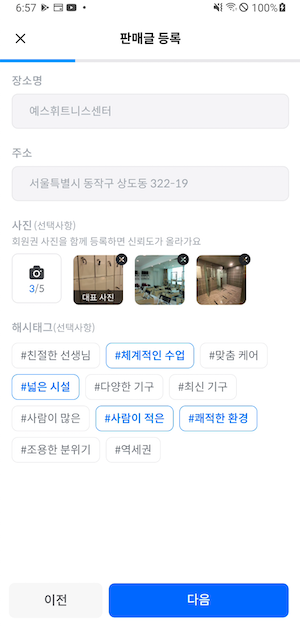

# Baton Android


# Contributors

<table align="center" style = "table-layout: auto; width: 100%; table-layout: fixed;">
  <colgroup>
    <col style="width:33%"/>
    <col style="width:34%"/>
    <col style="width:33%"/>
  </colgroup>
  <tr>
    <td>
       
    </td>
    <td>
        
    </td>
    <td>
        
    </td>
  </tr>
  <tr>
    <th align="center">김다빈</th>
    <th align="center">김효민</th>
    <th align="center">신승민</th>
  </tr>
  <tr>
    <td align="center">
     Github: <a href="https://github.com/dabinKim-0318">dabinKim-0318</a>
    </td>
    <td align="center">
     Github: <a href="https://github.com/HyomK">HyomK</a>
    </td>
    <td align="center">
     Github: <a href="https://github.com/greedy0110">greedy0110</a>
    </td>
  </tr>
</table>

# 바통 - 안쓰는 헬스 회원권, 내 근처에서 바통 터치!

```
야심차게 등록한 헬스장, 
혹시 생각치 못한 야근, 학업, 출장 등의 이유로 장기 결석하시나요? 
헬스장을 등록하고 싶지만 원하는 기간에 할인을 놓쳐 부담스러운 금액으로 고민이신가요?

바통은 헬스권 양도거래 플랫폼으로 장기결석으로 
붕 떠버린 회원권을 양도하면서 불필요한 소비를 줄이고, 
헬스장을 원하는 기간에 저렴한 가격으로 구매할 수 있습니다.
```
# Preview
 
# 주요 기능

```
[내 근처 헬스장]
집, 회사의 주소를 등록하고 가장 가까운 헬스장의 회원권 탐색해보세요.
```
 

```
[맞춤형 검색필터]
원하는 기간, 가격, 헬스장 정보까지 설정하고, 바통에서 원하는 회원권을 득템해보세요.
```


```
[간편한 회원권 등록]
복잡한 회원권 정보를 쉽고 빠르게 등록해보세요.
```

<br/><br/>

```
[빠른 거래를 위한 문의]
원하는 매물을 발견하셨나요? 바로 판매자에게 문의해 거래해보세요.
```
 


```
[마이 페이지]
개인 프로필을 꾸며보세요.
```
<br/><br/>

# 사용 기술

### Architecture

- [안드로이드 앱 아키텍쳐](https://developer.android.com/topic/architecture?gclid=CjwKCAjwk_WVBhBZEiwAUHQCmbPUOZlAD8HVhqvii5zz7RiiZ6da1-EZb-Eg-FcMoGfMkONn6YeqohoCXXIQAvD_BwE&gclsrc=aw.ds)

### Libs

- Asynchronous Task
    - Kotlin Coroutine
- Dependency Injection
    - Hilt
- Navigation
    - JetPack Navigation
- Unit Test
    - Kotest
- Communication
    - Moshi (for Serialization)
    - OkHttp (for HTTP communication)
    - Retrofit (for Type-safe REST API communication)
- Map
    - Naver Map
- Logging
    - Timber
- Image Loader
    - Glide
- OAuth
    - Kakao OAuth

### CI/CD

- Fastlane
- Github Actions
